<div align="center">

# Manşet

**Türkçe haber sitesi yazılımı — kurulumu FTP ile, bağımlılığı sıfır.**

PHP 8 · SQLite veya MySQL · Composer yok · npm yok · derleme adımı yok

[Öne çıkanlar](#öne-çıkanlar) · [Ekran görüntüleri](#ekran-görüntüleri) · [Kurulum](#kurulum) · [Temalar](#temalar) · [Güvenlik](#güvenlik)

</div>

---

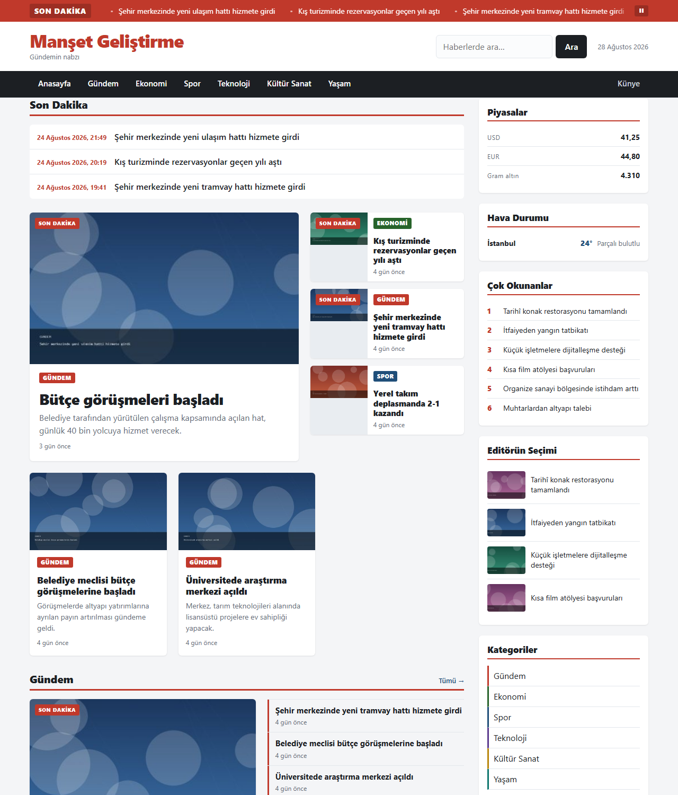

## Manşet nedir?

Manşet, **yerel ve bağımsız haber siteleri** için yazılmış bir yayın sistemidir.
Tasarım hedefi tek cümleyle: *paylaşımlı hostingde, FTP'den başka bir araç
kullanmadan çalışan, ama küçük bir haber odasının gerçekten ihtiyaç duyduğu
şeyleri eksiksiz veren bir sistem.*

Bu yüzden bazı şeyler bilinçli olarak **yok**:

| Yok | Neden |
|---|---|
| Composer / npm | Paylaşımlı hostingde çoğu zaman kullanılamaz. Ayrıca sıfır bağımlılık = sıfır tedarik zinciri riski. |
| Derleme adımı | Dosyaları yükleyin, çalışır. `git pull` sonrası "build" yok. |
| Dış JS/CSS kütüphanesi | Sayfa hızını ve gizliliği üçüncü taraflara emanet etmemek için. Tek istisna, yayıncının kendi seçtiği Google Fonts. |
| Node, Redis, Elasticsearch | Bir yerel haber sitesi bunlarsız da hızlı olabilir; olmayan bileşen bozulmaz. |

Buna karşılık **var**: çok kullanıcılı haber odası akışı, RSS içe aktarma,
yapay zekâ destekli yeniden yazma ve denetim ekranı, üyelik ve ölçülü ödeme
duvarı, çerezsiz kendi analitiği, tam metin arama, sürüm geçmişi ve BİK/Basın
Kanunu için künye altyapısı.

> **Şeffaflık notu.** Bu proje, bir insanın yönlendirmesiyle **yapay zekâ
> tarafından yazıldı.** Kod, testler ve belgeler bu şekilde üretildi; beş ayrı
> bağımsız güvenlik denetimi turundan geçirildi ve her sürüm çalışan bir
> kurulumda ölçülerek doğrulandı. Yine de kendi verinizle kullanmadan önce
> incelemenizi öneririz.

---

## Öne çıkanlar

**Haber odası**
- Rol tabanlı yetki: yayın yönetmeni, editör, muhabir, kaynak editörü, SEO editörü, reklam yöneticisi, moderatör
- **Sürüm geçmişi ve otomatik kayıt** — 30 saniyede bir, son 20 sürüm, tek tıkla geri alma
- **"Başkası düzenliyor" kilidi** — zaman aşımlı, açık uyarıyla devralınabilir
- Onay akışı: habere bağlı notlar, "revizyon iste", yayımlayanın kaydı
- Haftalık **yayın takvimi**, zamanlanmış yayın
- Çöp kutusu (yumuşak silme), yayından çekme (hukuki), düzeltme/cevap hakkı

**İçerik ve otomasyon**
- RSS kaynaklarından içe aktarma; çapraz kaynak tekrar tespiti, kaynak başına aralık
- **Yapay zekâ**: yeniden yazma, özet, başlık/spot/etiket önerisi, görsel alt metni
- **YZ denetim ekranı** — kaynak metin ile çıktı yan yana, fark vurgulu
- Gömme (YouTube, Vimeo) ve betiksiz sosyal medya kartları
- Medya kitaplığı: varyantlar arka planda üretilir, kullanılmayan görsel bulucu

**Okur**
- Beş tema, hepsinde **karanlık mod** ve 3 kademeli yazı ölçeği
- **Tam metin arama** — gövde dâhil (SQLite FTS5 / MySQL FULLTEXT, yoksa `LIKE`)
- Keşif: yazar sayfası, tarih arşivi, etiket bulutu, akıllı ilgili haberler
- Yorumlar: tek seviye yanıt, moderasyon, kara liste, personel rozeti
- Üyelik, abonelik ve **ölçülü ödeme duvarı** (ayda N ücretsiz haber, hediye bağlantısı)

**Yayıncı**
- **Çerezsiz analitik** — ham IP ve ham yönlendiren adresi saklanmaz
- Reklam alanları, gösterim/tıklama sayacı, `ads.txt`, sponsorlu içerik rozeti
- SEO: başlık şablonları, SERP önizlemesi, elle 301 yönlendirme, IndexNow, sitemap
- Ödeme sağlayıcı adaptörü (havale + barındırılan ödeme sayfası)
- Zamanlı ve **uzak yedek** (FTP), kurulum kontrol listesi
- **Künye / BİK** alanları ve düzeltme-cevap altyapısı

---

## Ekran görüntüleri

### Ön yüz

| Haber sayfası | Arama |
|---|---|
| 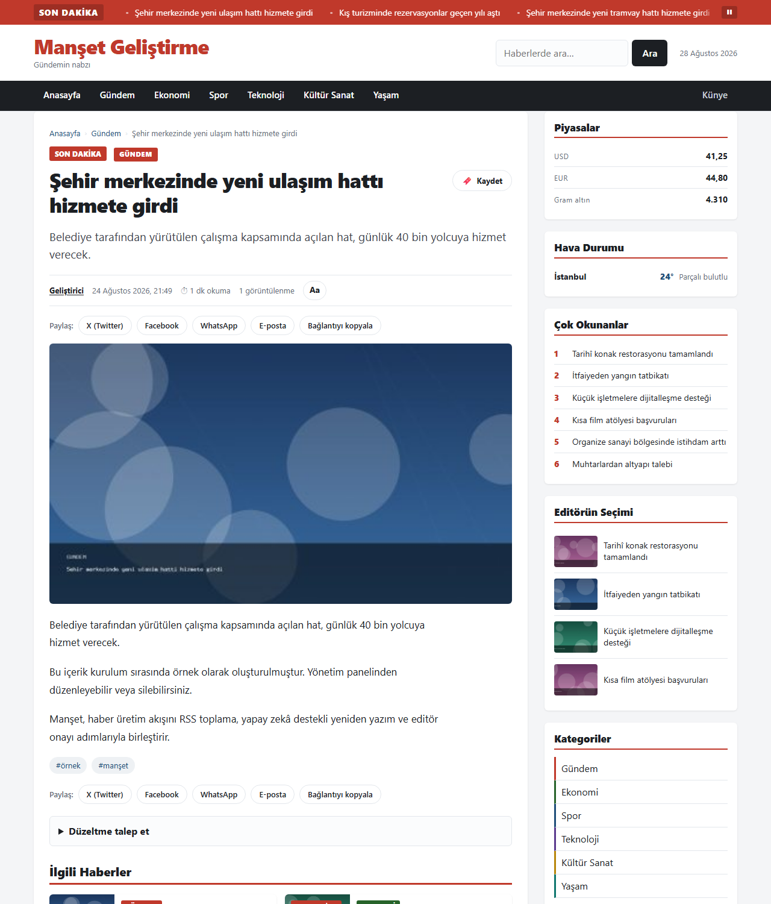 | 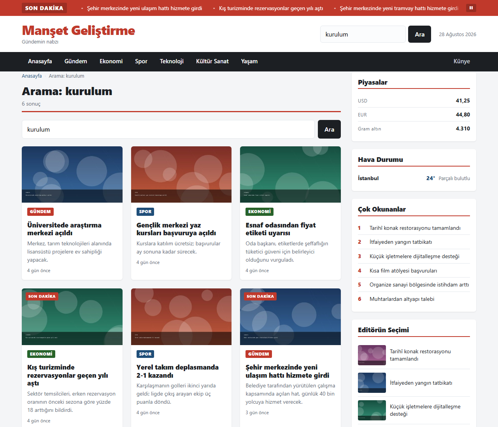 |

Aramadaki fark küçük görünür ama önemlidir: **haber gövdesi de aranır.**
Yukarıdaki ekran görüntüsünde aranan sözcük hiçbir başlıkta, spotta veya etikette
geçmiyor — yalnız metinlerin içinde. Arama motoru bulunamadığında sistem sessizce
`LIKE`'a düşer; arama hiçbir kurulumda bozulmaz, yalnız daha basit çalışır.

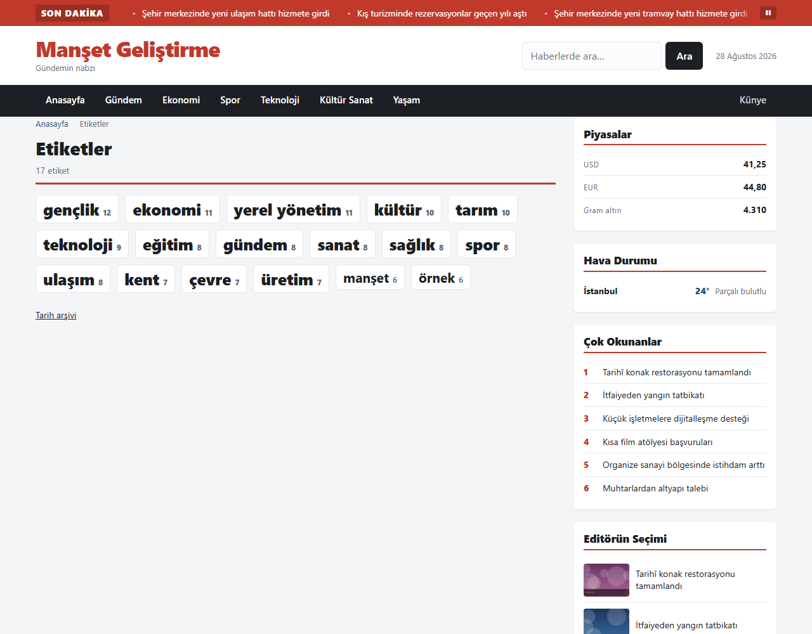

### Yönetim paneli

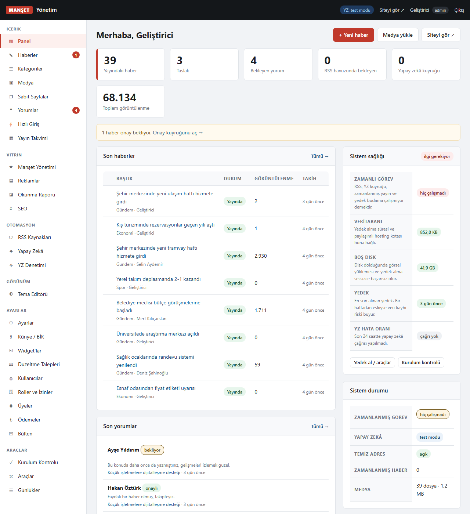

Menüdeki rozetler **bekleyen işi** gösterir (onay bekleyen haber, yeni yorum, YZ
hatası). Sağdaki sağlık kartı sessiz arızaları yakalamak içindir: cron kaç
saattir çalışmıyor, son yedek ne kadar eski, disk doluyor mu.

| Haber listesi | Yorum moderasyonu |
|---|---|
| 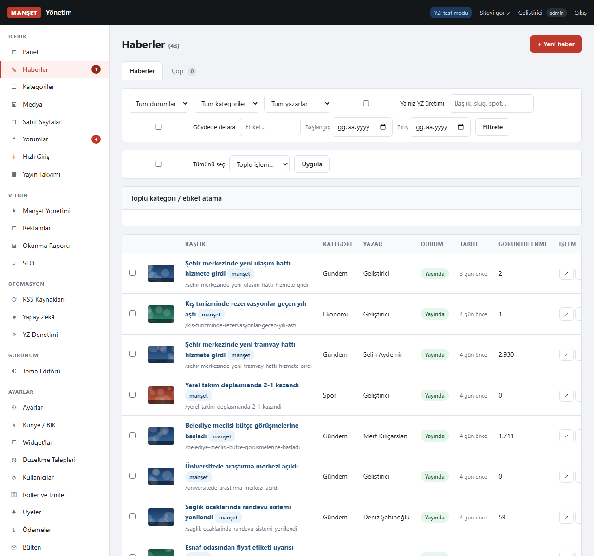 | 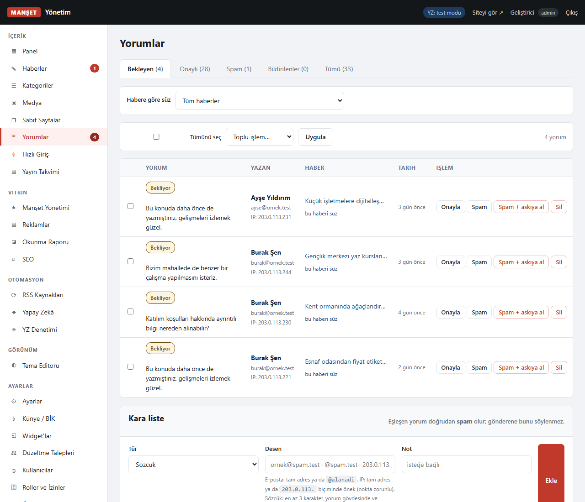 |

**Yapay zekâ denetim ekranı** — kaynak metinle çıktı yan yana. Otomatik yayın ile
yeniden yazma birlikte açıksa, arayüz bunu ayrıca uyarır:

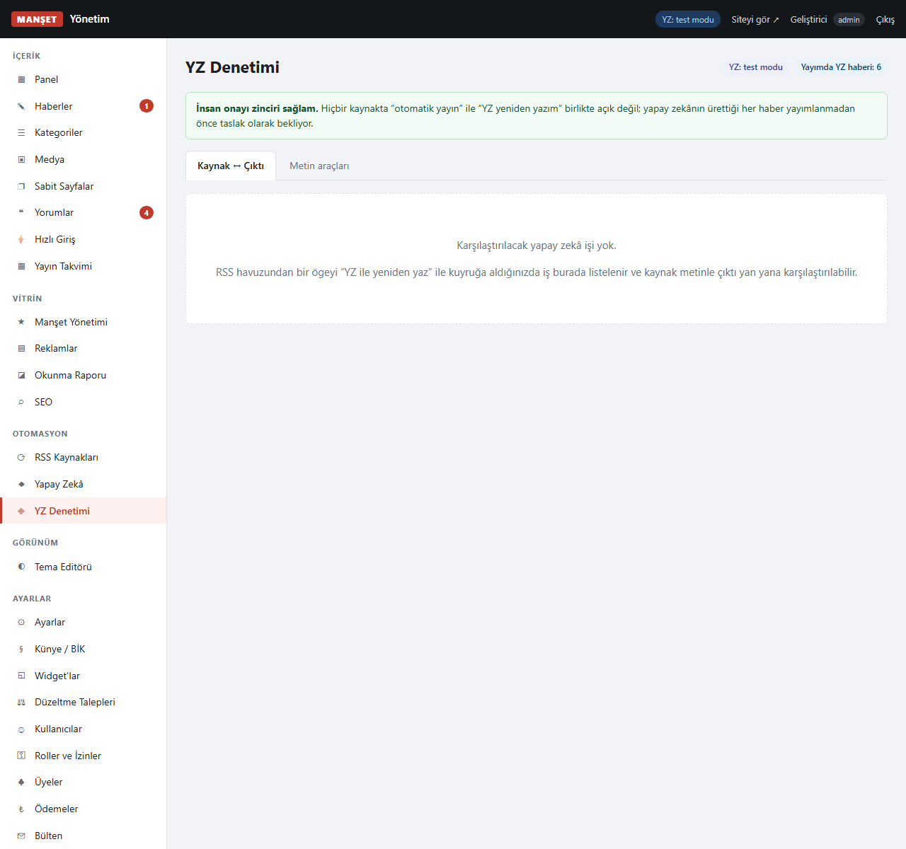

| Okunma raporu | Yayın takvimi |
|---|---|
| 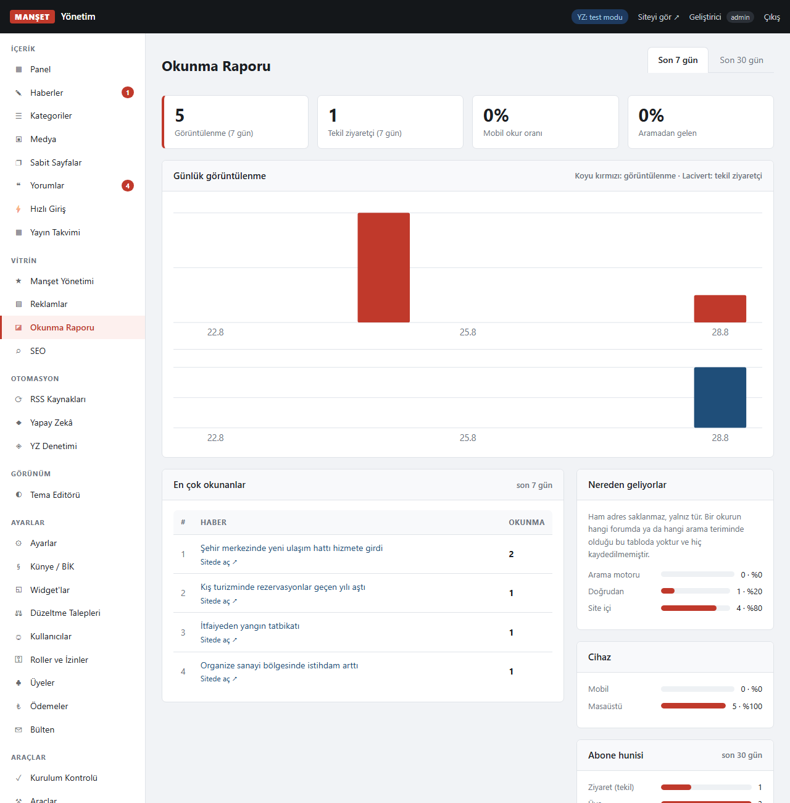 | 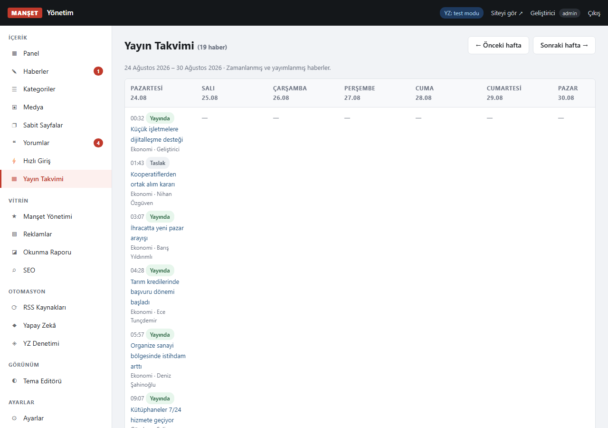 |

**Roller ve izinler** — matris düzenlenebilir, ama çekirdek yetkiler kilitlidir
(aşağıya bakın):

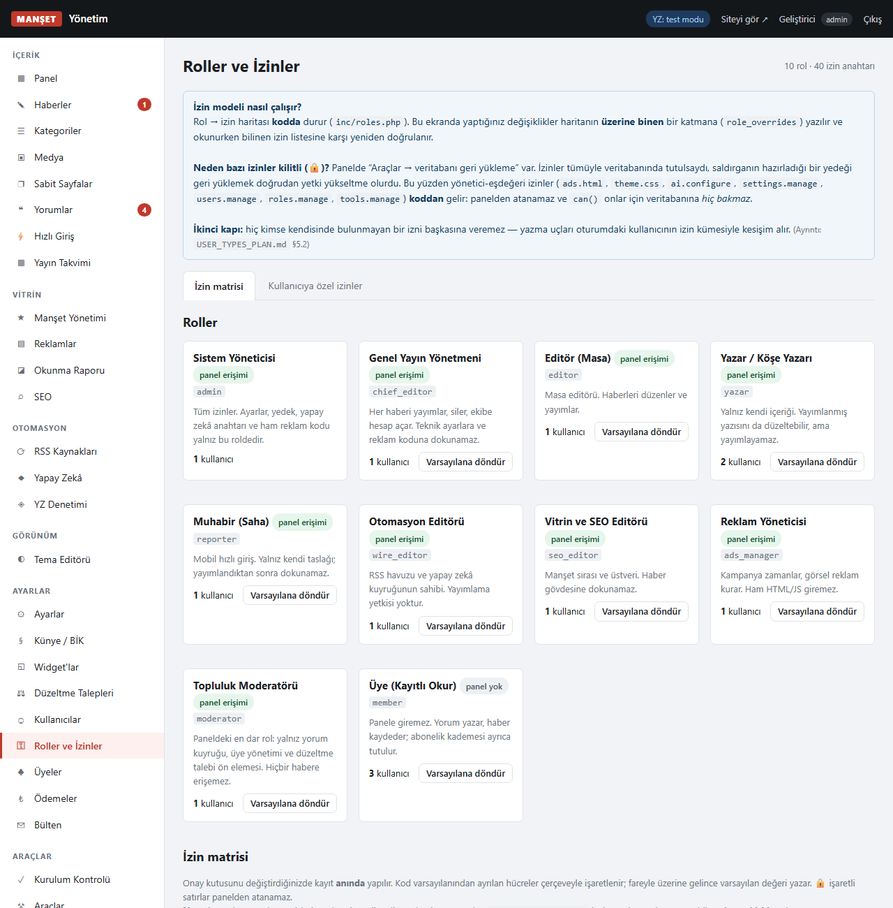

**Kurulum kontrol listesi** — her açılışta yeniden ölçülür, "tamamlandı" işareti
tutulmaz. Bir madde bugün yeşilse yarın kırmızı olabilir: alan adı değişir, cron
kaldırılır, yedek almayı bırakırsınız.

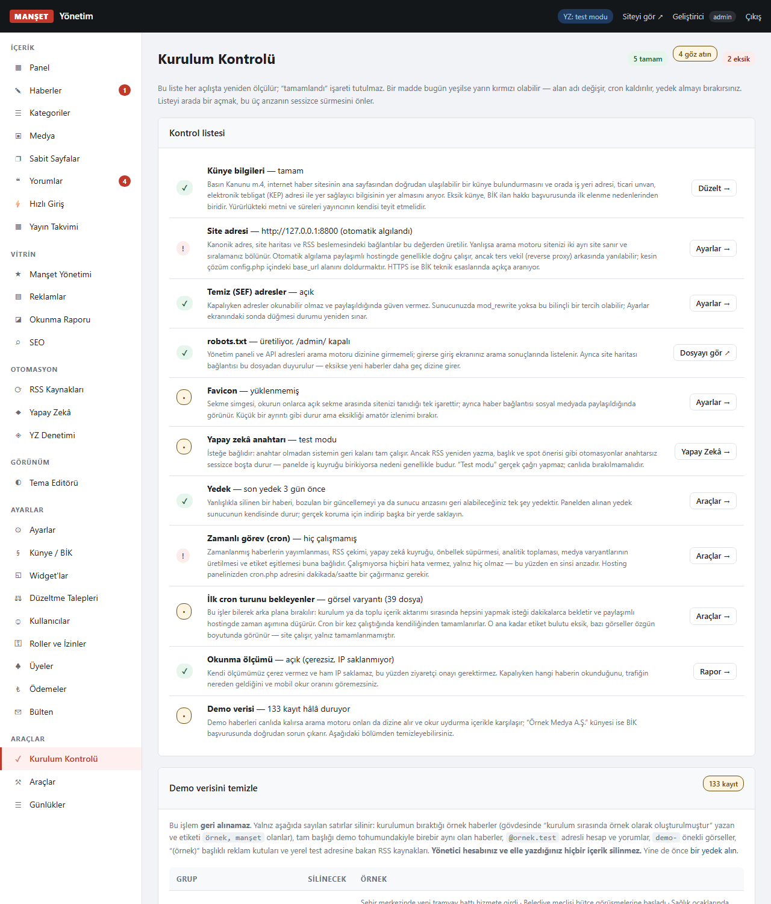

---

## Gereksinimler

**Zorunlu**
- PHP **8.0** veya üzeri
- PDO + `pdo_sqlite` **veya** `pdo_mysql`
- **`dom` (DOMDocument)** — haber gövdesinin güvenlik temizliği buna dayanır
- `SimpleXML` (RSS çekimi)
- `db/`, `uploads/` ve kök klasörde yazma izni

**Önerilen**
- `mbstring` — kapalıysa Manşet kendi yedek fonksiyonlarını kullanır
- `GD` — kapalıysa görsel boyutlandırma yapılmaz, özgün görsel kullanılır
- `cURL` veya `allow_url_fopen` — RSS ve yapay zekâ çağrıları için
- `mod_rewrite` — temiz adresler için (yoksa `?r=` yedeği devreye girer)

> **`dom` neden zorunlu?** `sanitize_html()` HTML temizliğini `DOMDocument` ile
> yapar. Eklenti yoksa sistem **güvenli tarafa kapanır** ve haber gövdesindeki
> tüm biçimlendirmeyi atar. Düzenli ifadeyle HTML temizlemek güvenli hâle
> getirilemez; bu yüzden zayıf bir yedek yol sunmak yerine hiç sunmuyoruz.

---

## Kurulum

1. Tüm dosyaları sunucunuza yükleyin (örn. `public_html/`).
2. Tarayıcıdan `https://siteniz.com/` adresini açın — kuruluma yönlendirilirsiniz.
3. **Adım 1 — Gereksinimler:** Kırmızı (✕) maddeler giderilmeden devam edilemez.
4. **Adım 2 — Bilgiler:** Site adı, yönetici hesabı, veritabanı, tema.
5. **Adım 3 — Kurulum:** Tamamlanır ve `install/.locked` yazılır.
   **`install/` klasörünü sunucudan silmeniz önerilir.**

Kurulum kökte `config.php` üretir; veritabanı bilgileri, `cron_key` ve `app_key`
oradadır. **Sürüm kontrolüne eklemeyin, ama mutlaka yedekleyin** — `app_key`
kaybolursa şifreli ayarlar (API anahtarları) çözülemez.

### MySQL ile kurulum
Veritabanını ve kullanıcıyı hosting panelinizden **önceden oluşturun**
(`utf8mb4` önerilir), sonra sihirbazda MySQL'i seçin.

### Alt klasöre kurulum
`https://siteniz.com/haber/` gibi bir alt klasöre kurarsanız `.htaccess` içindeki
`RewriteBase` satırını açın:

```apache
RewriteBase /haber/
```

### Temiz adresler çalışmıyorsa
Manşet bunu kendiliğinden algılar ve adresleri `?r=haber/ornek-1` biçiminde
üretir — site tam çalışır. `mod_rewrite` etkinleştirdikten sonra
**Panel → Ayarlar → Temiz adres sondası → Yeniden sına** düğmesini kullanın.

---

## Zamanlanmış görev (cron)

RSS çekimi, YZ kuyruğu, zamanlanmış yayın, önbellek bakımı, analitik toplaması,
medya varyantları, etiket eşitlemesi ve yedek alma `cron.php` ile yürür.
Hosting panelinizin "Cron Jobs" bölümüne **10 dakikada bir** ekleyin:

```
*/10 * * * * curl -s "https://siteniz.com/cron.php?key=CRON_ANAHTARINIZ"
```

Komut satırından:

```
php /home/kullanici/public_html/cron.php --key=CRON_ANAHTARINIZ
```

Anahtarı **Panel → Ayarlar** ekranında hazır komut olarak bulabilirsiniz.

> **Cron kurulmazsa ne olur?** Site çalışır, ama sayılan işler *hiç* olmaz ve
> hiçbiri hata vermez — bu yüzden en sinsi arızadır. Kurulum kontrol listesi
> cron'un ne zaman çalıştığını gösterir. Gerçek cron kuramıyorsanız panel
> ziyaretlerinde tetiklenen bir yedek mekanizma vardır, ama düzenli bir cron
> kadar güvenilir değildir.

---

## Yapay zekâ

Manşet, YZ'yi bir **adaptör** üzerinden kullanır: sağlayıcı ve model ayardan
seçilir, anahtar panelden girilir ve **şifreli** saklanır.

**Ne yapar:** RSS'ten gelen metni yeniden yazma, özet, başlık/spot önerisi,
kategori ve etiket önerisi, görsel alt metni, paylaşım metni.

**Maliyet sizin sağlayıcı hesabınızdadır.** Panelde çağrı sayısı, tüketilen
belirteç ve hata oranı görünür; bütçe tavanı koyabilirsiniz.

**Anahtar girmezseniz** sistem "test modu"nda çalışır: YZ çağrıları yapılmaz,
geri kalan her şey normal işler.

### Yapay zekâ ile üretilen içerik hakkında
YZ ile yeniden yazılmış haberler veritabanında işaretlenir. Otomatik yayın ile
yeniden yazmayı **birlikte** açarsanız, insan okumadan içerik yayına çıkar —
arayüz bunu açıkça uyarır. Bu birleşimi bilinçli olmadan açmayın; yayıncı
sorumluluğu size aittir.

---

## Temalar

Kutuda beş tema gelir: **gazete**, **kagit**, **bulten**, **gece**, **yerel**.
Hepsi karanlık modu ve okuma ayarlarını destekler.

Tema geliştirmenin altın kuralı: **şablonlar veritabanına asla doğrudan
dokunmaz.** Yalnızca `inc/view.php`'nin sunduğu veri fonksiyonlarını çağırırlar.
Böylece bir tema, çekirdek değişse de çalışmaya devam eder ve bir tema hatası
veri katmanını bozamaz.

Bir tema klasörü şuna benzer:

```
themes/temam/
  theme.json        ad, sürüm, ayar şeması, renk değişkenleri
  layout.php        <html> iskeleti ve kanca noktaları
  home.php  single.php  category.php  page.php  search.php  notfound.php
  parts/            header, footer, sidebar, card, comments, okuma-ayarlari…
  style.css
```

`<html>` etiketi üç özniteliği basmak zorundadır — okuma tercihleri
`localStorage`'da tutulur, çerezde değil, böylece sayfa önbelleği bozulmaz:

```php
<html lang="tr" data-tema="<?= esc($okumaTema) ?>"
      data-goruntu="<?= esc($okumaGoruntu) ?>" data-olcek="orta">
```

Zorunlu kanca noktaları, veri fonksiyonlarının tam listesi ve blok dizilimi
`themes/gazete/` içindeki yorumlarda ve `theme.json` dosyalarında belgelidir.
Yeni bir temaya başlamanın en kolay yolu `gazete`yi kopyalamaktır.

---

## Roller ve üyelik

| Rol | Ne yapar |
|---|---|
| `admin` | Her şey. Kilitli izinler yalnız bu roldedir. |
| `chief_editor` | Genel yayın yönetmeni: yayımlar, siler, künyeyi düzenler, kullanıcı yönetir |
| `editor` | Yayımlar, her haberi düzenler, yorumları yönetir |
| `yazar` | Kendi haberini yazar ve yayın sonrası düzeltir |
| `reporter` | Muhabir: kendi haberini yazar, yayımlayamaz |
| `wire_editor` | Kaynak/YZ haberlerini düzenler, RSS yönetir |
| `seo_editor` | Yalnız üstveri (SEO), manşet ve tema ayarları |
| `ads_manager` | Reklam alanları ve zamanlama |
| `moderator` | Yorum ve üye moderasyonu, düzeltme talepleri |
| `member` | Ön yüz üyesi — yorum yazar, abone olabilir |

### İzin matrisi düzenlenebilir — ama çekirdeği kilitli

Roller ve izinler panelden değiştirilebilir. Ancak bazı izinler **kilitlidir**
ve hiçbir role atanamaz — veritabanına elle yazılsa bile yok sayılır:

`settings.manage` · `users.manage` · `roles.manage` · `tools.manage` ·
`ads.html` (ham HTML/JS reklam kodu) · `ai.configure` (YZ anahtarı) ·
`theme.css` (özel CSS) · `payments.manage` (tahsilat)

Gerekçe basit: bunların her biri **kod çalıştırma ya da para** yetkisidir.
Bir moderatöre yanlışlıkla verilmiş bir onay kutusu, siteyi ele geçirmeye yeter.

### Üyelik ve abonelere özel içerik

Haberler üç görünürlükte olabilir: **herkese açık**, **üyelere özel**,
**abonelere özel**. Kilitli haberde okur önizleme metnini ve bir kilit kutusu
görür. Ölçülü duvar açıksa okur ayda N kilitli haberi ücretsiz okuyabilir;
sayaç **okurun imzalı çerezinde** durur, sunucuda kayıt tutulmaz — çerezsiz
ziyaretçiyi izlememek için. Karşılığında okur çerezini silerse sayaç sıfırlanır;
bu bilinçli bir tercihtir.

---

## Künye ve BİK notu

Manşet, künye alanlarını (imtiyaz sahibi, sorumlu yazı işleri müdürü, ticari
unvan, iş yeri adresi, KEP adresi, yer sağlayıcı) ayrı bir ekranda toplar ve
ana sayfadan doğrudan ulaşılabilir bir künye sayfası üretir. Düzeltme ve cevap
hakkı için ayrı bir akış vardır.

> **Uyarı.** Bu yazılım hukuki uygunluk garantisi vermez. Basın Kanunu ve BİK
> düzenlemeleri değişebilir; **yürürlükteki metni ve süreleri yayıncının kendisi
> teyit etmelidir.** Kurulum kontrol listesi yalnızca alanların dolu olup
> olmadığını denetler, içeriğin doğruluğunu değil.

---

## Güvenlik

- **SQL:** yalnız PDO hazır ifade. Dize birleştirmeli sorgu yok; bir denetim
  betiği bunu her koşuda doğrular.
- **XSS:** çıktıda kaçış; haber gövdesi beyaz listeli `DOMDocument` temizleyiciden
  geçer. `iframe` yalnız beyaz listedeki video sağlayıcılarına açıktır.
- **CSRF:** tüm yazma uçlarında zorunlu.
- **Yetki:** her API ucu ve her panel sayfası sunucuda kapıdan geçer; haritada
  olmayan sayfa **açılmaz** (fail-closed).
- **Parola:** `password_hash`; belirteçler veritabanında yalnız SHA-256 özeti
  olarak durur.
- **Oturum:** `httponly` + `samesite=Lax` + HTTPS'te `secure`.
- **Sırlar:** API anahtarları ve ödeme sağlayıcı bilgileri `app_key` ile
  **şifreli** saklanır — `app_key` `config.php`'dedir, yani yedeğe girmez.
- **Başlıklar:** CSP, `X-Frame-Options`, `Permissions-Policy`, HSTS (yalnız HTTPS
  isteğinde), `nosniff`, `Referrer-Policy`.
- **CORS:** hiçbir uçta açık değildir; API aynı kökene kapalıdır.
- **Yükleme:** uzantı **ve** gerçek MIME doğrulaması, SVG reddi, çift uzantı
  koruması, rastgele dosya adı, `uploads/` içinde PHP çalıştırma kapalı.
- **Günlük:** yazılmadan önce bilinen sır biçimleri maskelenir.
- **Bağımlılık:** yok. Denetlenecek üçüncü taraf paket bulunmadığı için tedarik
  zinciri saldırı yüzeyi de yoktur.

> **CSP hakkında dürüst not.** Panelde ve temalarda satır içi `<script>` blokları
> olduğu için CSP `'unsafe-inline'` içerir. Yani **CSP bir XSS savunması
> değildir** — XSS savunması HTML temizleyicidir. CSP'nin gerçekten kapattığı
> şeyler: dış betik yükleme, `object`/`embed`, `<base>` ile adres kaçırma,
> formun başka siteye gönderilmesi ve sayfanın yabancı bir siteye gömülmesi.

### Apache dışı sunucular — bunu atlamayın

Dosya erişim kuralları `.htaccess` ile uygulanır ve **`.htaccess` yalnız
Apache'de okunur.** Nginx, IIS, LiteSpeed'in bazı kipleri ya da Caddy altında bu
dosya sessizce yok sayılır: site çalışır, ama `db/` altındaki veritabanı ve
**yedekler** doğrudan indirilebilir hale gelir. Hiçbir hata mesajı görmezsiniz.

Kurulumdan sonra bir kez elle sınayın:

```
curl -I https://siteniz.com/db/
```

`403` ya da `404` görmüyorsanız koruma yoktur. **Nginx** için:

```nginx
location ~ ^/(db|inc|install)/  { deny all; return 404; }
location ~ ^/(config\.php)$     { deny all; return 404; }
location ~ \.(sqlite|sqlite-wal|sqlite-shm|sql|tar)$ { deny all; return 404; }
location ^~ /uploads/ { location ~ \.php$ { deny all; return 404; } }
```

**IIS** için `web.config` içinde `<requestFiltering>` ile `db`, `inc`, `install`
dizinlerini gizleyin ve `.sqlite` / `.tar` uzantılarını reddedin.

---

## Yedekleme

Panelden elle yedek alabilir, ayrıca **günlük veritabanı** ve **haftalık
`uploads` arşivi** için zamanlı yedek kurabilirsiniz. Uzak hedef olarak saf PHP
`ftp_*` desteklenir.

> Panelden alınan yedek **sunucunun kendisinde durur.** Gerçek koruma için
> indirip başka bir yerde saklayın ya da uzak hedefi yapılandırın. Yedek
> dosyaları veritabanının tamamını içerir — üçüncü bir sunucuya gönderiyorsanız
> o sunucunun güvenliği de sizin sorumluluğunuzdadır.

---

## Yükseltme

Yeni sürümün dosyalarını FTP ile üstüne atın ve panele bir kez girin. Şema
kendiliğinden güncellenir; **öncesinde otomatik yedek alınır.** `config.php` ve
`db/` klasörü korunur.

Göç yalnız yetkili bir bağlamda tetiklenir — kimliği doğrulanmamış bir istek
şema değiştiremez.

---

## Geliştirme ve testler

```bash
# geliştirme kurulumu (proje kökünde çalışan bir örnek üretir)
php tests/dev-install.php
php tests/demo-seed.php          # örnek içerik

# birim testleri (Composer'sız koşucu)
php tests/unit/run.php

# uçtan uca (gerçek PHP sunucusu + curl)
bash tests/e2e.sh

# sözleşme denetimi: SQL içinde yalnız tek tırnak
php tests/kural-sql.php .
```

`tests/probe.php` yapısal sondalar içerir — bunlar tek bir hatayı değil, bir
**hata sınıfını** kapatmak için yazılmıştır:

| Sonda | Ne arar |
|---|---|
| `missing_perms` | Kapıda kullanılan ama katalogda tanımsız izin |
| `unused_perms` | Katalogda tanımlı ama hiçbir kapıda okunmayan izin (ölü yetki) |
| `dup_api` | Aynı API ucunu iki dosyada tanımlama |
| `paywall_leak` | Kilitli haber gövdesinin metin üreten yollardan sızması |
| `backup_secret` | Yedeğin içinde düz metin API anahtarı |
| `srcset_gate` | HTML temizleyicinin `srcset` kapısı |
| `cors` | Herhangi bir yerde açılmış CORS başlığı |
| `bagimlilik` | Depoya sızmış Composer/npm izi |

---

## Lisans

MIT — `LICENSE` dosyasına bakın.

## Katkı ve güvenlik bildirimi

Güvenlik açığı bulursanız lütfen genel bir issue açmadan önce depo sahibiyle
iletişime geçin.
